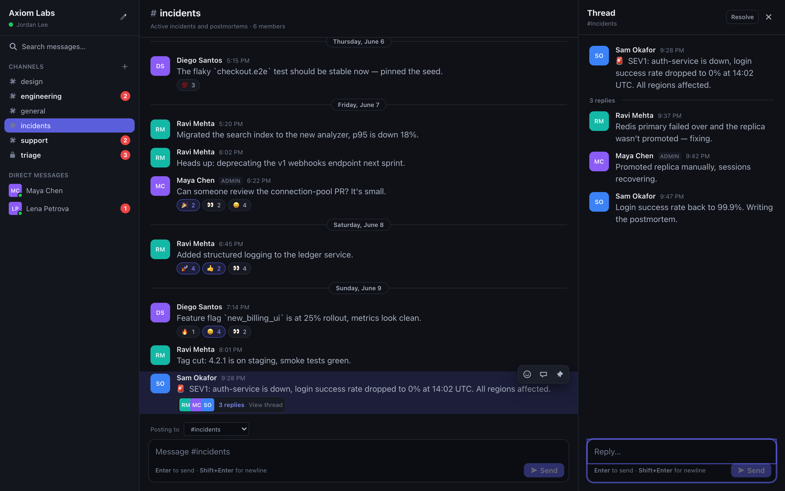

# AxiomChat

A **world-class, deterministic, resettable mini-Slack** — axiom's 4th training
environment (`axiomchat`). A React + Vite + TypeScript + Tailwind SPA backed by
an in-memory Express + TypeScript server. Agents drive it through Playwright via
the `axiomchat` env; a privileged **oracle** endpoint holds hidden ground truth.

> Scope: this is the **environment** (Pillar 1). The proxy/oracle *reward*
> machinery is Pillar 2 and intentionally lives elsewhere — AxiomChat only
> **populates and gates** the ground-truth labels, it does not score them.



## Why it's built this way

Three non-negotiable "training-grade" properties:

1. **Determinism.** Every workspace is generated from a seed via a `mulberry32`
   PRNG. There is **no `Date.now()` / `Math.random()`** in seeding or render —
   timestamps derive from a fixed `BASE_EPOCH`, and even agent-posted messages
   get a deterministic `ts = maxTs + 1min`. Same seed → byte-identical
   `/api/state` **and** byte-identical screenshots.
2. **Stable `data-testid`** on every interactive element (catalog below). The
   axiom DOM-parser preserves `data-testid` / `role` / `aria-label`, so agents
   select on stable hooks rather than brittle text/CSS.
3. **`data-app-ready="true"`** is set on the root once the SPA has hydrated from
   `/api/state`, so Playwright waits on a *signal*, not a timeout. A
   `data-busy` flag on `<html>` similarly marks in-flight mutations so per-step
   goal checks observe the re-rendered DOM.

## Layout

```
apps/axiomchat/
  src/                 # Express server (TypeScript)
    types.ts           # domain model (User/Channel/Message + hidden _ labels)
    seed.ts            # mulberry32 + seedWorkspace(seed, scale) + scenarios
    store.ts           # in-memory store; strips _ fields for public reads
    server.ts          # createApp(store) factory + /api/* routes
  test/                # vitest: determinism, no-leak, CRUD, oracle (34 tests)
  web/                 # React SPA (Vite + Tailwind)
    src/components/     # Shell, Sidebar, MessageRow, Composer, ThreadPane, ...
    src/store.ts        # single source-of-truth, hydrates from /api/state
    src/selectors.ts    # pure derivations (no clocks/random)
  Dockerfile           # multi-stage: SPA build -> server build -> slim runtime
```

## Build & run

```bash
# from the repo root
make axiomchat-build      # vite build (SPA) + tsc (server)
make axiomchat-run        # serves http://localhost:3100  (PORT=3100)
make axiomchat-test       # vitest backend suite

# or via Docker (compose)
docker-compose up axiomchat-app   # healthy on :3100
```

Local dev with hot reload: `cd web && npm run dev` (proxies `/api` to `:3100`).

## API

Public surface (the SPA and agents use this; **never** leaks `_` fields):

| Method & path | Purpose |
|---|---|
| `GET /api/health` | Liveness `{status:"ok",...}` |
| `GET /api/state` | Full public workspace (users, channels, messages) — **all `_` fields stripped** |
| `GET /api/channels` | Channel list |
| `GET /api/channels/:id/messages` | Top-level messages in a channel (oldest first) |
| `GET /api/threads/:rootId` | Thread root + replies |
| `POST /api/messages` | Create a message `{channelId, text, threadRootId?, authorId?}` |
| `PATCH /api/messages/:id` | `{op:"react"\|"pin"\|"resolve"\|"edit", ...}` |
| `POST /api/search` | `{query}` → matching messages |
| `POST /api/reset` | `{seed, scale}` → deterministic re-seed |

Privileged:

| Method & path | Purpose |
|---|---|
| `GET /api/_oracle/state` | Full state **including hidden `_` labels** + derived ground truth. Gated by the `X-Oracle-Token` header — **403** without a valid token. |

### Seeding & reset

```bash
curl -X POST localhost:3100/api/reset -H 'content-type: application/json' \
     -d '{"seed":1,"scale":"medium"}'
```

- `seed` (int): selects the workspace. Same seed ⇒ identical `/api/state`.
- `scale`: `small` | `medium` (default) | `large` — controls channel/message volume.

The env passes `{seed, scale}` automatically from `TaskConfig` on every episode
reset (via `AxiomChatEnvironment._reset_server()`).

### The oracle (hidden ground truth)

`GET /api/_oracle/state` returns the workspace **with** the `_`-prefixed labels
plus a `derived` block summarizing them. It is gated by `X-Oracle-Token`
(server env `AXIOMCHAT_ORACLE_TOKEN`, default `axiom-oracle-dev-token`):

```bash
curl localhost:3100/api/_oracle/state -H 'X-Oracle-Token: axiom-oracle-dev-token'
# 403 without a valid token
```

Seeded scenarios carry the hidden labels Pillar 2 will reward against:

| Scenario | Channel | Hidden labels |
|---|---|---|
| Unanswered question | `#support` | `_isQuestion`, `_answerFacts` |
| Incident thread | `#incidents` | `_severity`, `_summaryFacts` |
| DM request needing an owner | DM | `_correctAssigneeId` |
| Triage backlog | `#triage` | `_severity`, `_correctAssigneeId` |

## `data-testid` catalog

Stable, canonical hooks agents select on:

- **Sidebar**: `workspace-header`, `channel-list`, `channel-link-{id}`, `dm-link-{id}`, `unread-{id}`, `add-channel`
- **Channel header**: `channel-header`, `channel-name`, `channel-details`
- **Messages**: `message-list`, `message-{id}`, `message-author-{id}`, `message-text-{id}`, `react-{id}`, `reaction-{id}-{emoji}`, `thread-open-{id}`, `thread-count-{id}`, `pin-{id}`, `new-messages-divider`
- **Composer**: `message-input`, `send-button`, `channel-select`, `mention-menu`, `mention-{userId}`
- **Thread pane**: `thread-pane`, `reply-input-{rootId}`, `reply-send-{rootId}`, `resolve-thread-{id}`
- **Search**: `search-input`, `search-button`, `search-result-{id}`
- **DM**: `dm-view`
- **Root**: `data-app-ready="true"` once loaded

## Tasks

`tasks/axiomchat/*.yaml` define agent tasks against this env using existing goal
types (`custom_js`): `post_message`, `reply_in_thread`, `react_to_message`,
`pin_message`. Goal scripts must be **expressions / IIFEs** (Playwright's
`page.evaluate` rejects a bare top-level `return`).
