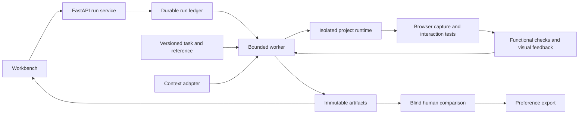

# Axiom AI: a workbench for evaluating website redesign agents

Status: proposed direction, not implemented. Written 2 October 2026.

## Product decision

**Axiom AI — Better AI websites, with proof.**

Give Axiom a working web project, a design brief, and a reference brand. It runs a redesign agent, tests the result in a browser, and shows what improved and what broke.

The primary user is an engineer building an AI website generator or coding agent. Their decision is concrete: which agent, context, or revision strategy produces a better page without damaging the product? Axiom supplies repeatable tasks, a controlled editing environment, browser checks, visual review, and inspectable run records. Its flagship experience makes those capabilities visible through an actual redesign.

The first supported domain is **brand-guided redesign of small working websites**. The first release supports curated React/Vite projects. An arbitrary website URL is not editable source; support for importing arbitrary repositories or websites is outside the first release.

Model weights remain fixed. Agents improve a page during a run through feedback and revision. Axiom does not train foundation models. Its recorded trajectories and separately labeled preferences can later become inputs to training experiments, but exporting JSONL alone does not demonstrate training effectiveness.

## Input and output contract

| Input | Requirement |
|---|---|
| Working project | Versioned starter snapshot, fixed dependencies, local assets, known application behavior |
| Brief | Audience, purpose, desired brand characteristics, editable scope, and preserved content |
| Reference | An owned or licensed reference page and structured brand context, each with a version |
| Agent configuration | Provider/model version, prompt version, allowed tools, attempt and cost limits |

| Output | What the user can inspect |
|---|---|
| Candidate page | Rendered desktop/mobile page and source patch |
| Functional report | Content preservation, key interactions, build/runtime results, and relevant accessibility checks |
| Visual assessment | Specific observations tied to the brief, reference, screenshots, and evaluator version |
| Revision history | Each candidate, feedback, accepted/rejected change, time, and measured provider usage |
| Comparison | Original versus candidate, and comparable agent runs under a disclosed budget |
| Evidence bundle | Content hashes, task/run manifests, source snapshots, screenshots, tests, and optional human preferences |

Keep three questions visible: **Does it work? Does it follow the brief? Which version do people prefer?** They are related but not interchangeable. A brand adherence score is not a universal measure of beauty. A screenshot preference is not evidence that the checkout works.

## The flagship demonstration

Use an original coffee shop with a small catalog, prices, navigation, and a working demo bag. The neutral starting page should be plausible, not deliberately broken to manufacture an improvement.

Example brief: “Make this shop feel like the supplied warm editorial brand. Preserve every product and price. Keep the bag usable on mobile.”

1. Show the working original, the brief, and the reference together.
2. Start a real local run. The agent edits source files rather than selecting a finished theme.
3. Render the candidate at 1440, 768, and 375 pixels. Show actual screenshots and the live isolated preview.
4. Display concrete findings, such as a wrapped navigation label or an obscured bag button, only if observed.
5. Let the agent revise using actionable feedback within a fixed budget. Keep rejected candidates inspectable.
6. Show before/after, operate the bag, inspect the patch, and open the evidence report.
7. Optionally ask a reviewer which candidate better meets the brief. Preserve ties and uncertainty.

A 60–90 second edited walkthrough should convey this story; it is not a promised run latency. Public visitors get an explicitly labeled replay of a real run without credentials. Local users can reproduce it live. Cache labels, actual execution timings, model identity, and failure states remain visible in the run detail.

Include one representative success and one instructive failure. A report that says “functionality passed; visual preference inconclusive” is a valid outcome. Do not script an alleged agent mistake or repair and present it as spontaneous behavior.

## Product surface

The landing page leads with a working example and the sentence above. The workbench has one dominant page preview, a compact brief/reference panel, a timeline, and an evidence drawer. Desktop/mobile switching and before/after inspection are primary controls. Methodology and raw artifacts are secondary details.

A comparison page answers one practical question at a time, such as whether reference context helped this agent. Avoid leading with a global leaderboard, reward formula, or opaque “slop score.” Keep the interface visually quiet so the generated pages are the focus. Test comprehension with unfamiliar viewers: after ten seconds, can they explain the input, output, and purpose without hearing an RL explanation?

## Existing repository assessment

This assessment is based on source inspection, not a fresh execution of all legacy experiments.

| Existing asset | Decision and constraint |
|---|---|
| `axiom/core/base_env.py` | Reuse lifecycle ideas: reset, observe, step limits, cleanup. Its reward-oriented return types are not the new design contract. |
| `axiom/envs/webapp_env.py`, `axiom/utils/` | Adapt browser capture and readiness handling. Existing code is coupled to task goals and current apps; it is not already a design environment. |
| `axiom/core/trajectory.py` | Reuse recording patterns. Add immutable multi-viewport artifacts, source diffs, content hashes, and evaluator provenance. |
| `axiom/api/` | Reuse FastAPI conventions, validation, errors, and request IDs. Add separate versioned run endpoints. |
| `axiom/core/session.py` | In-memory lifecycle management is useful locally, but durable jobs, restart recovery, and ownership require new work. |
| `axiom/core/parallel_runner.py` | Reuse bounded concurrency concepts after proving independent workspaces and app state. A semaphore alone does not isolate episodes. |
| `axiom/core/llm_judge.py` | Current judge sends task/trajectory/state text, not screenshot images. Build a new visual evaluator. |
| `axiom/models.py`, `axiom/core/evaluator.py` | Current completion/efficiency/accuracy/safety schema and weighted averaging do not express this product. Add typed design assessments. |
| `axiom/envs/cli_env.py` | Temporary directories and command filtering are not the execution boundary for generated apps. Do not extend this runner into unrestricted build execution. |
| `static/demo.html` | A useful replay pattern, not a live browser execution service. Replace the primary experience once the new flow works. |
| AxiomChat and robustness experiments | Retain as historical research with their limitations. Reuse regression-testing discipline, not their scalar metric or oracle terminology for aesthetics. |

The current README/landing claim that rewards cannot be cheated is stronger than the writeup's documented residual failures. Retire that claim in the migration. Do not infer that all existing robustness work is invalid: the recorded failures and explicit limitations are useful engineering evidence.

## Architecture



Use Python/FastAPI for orchestration and React/TypeScript/Vite for the workbench. Start with one local worker, SQLite for durable metadata, and filesystem artifact storage behind a narrow interface. Static replay bundles can remain compatible with static hosting. Multiple workers, a hosted queue, Postgres, object storage, and authenticated public execution are later operational choices, not prerequisites for a credible first release.

Proposed new modules:

```text
axiom/design/
  models.py          # Task, run, revision, evidence and preference contracts
  environment.py     # Reset, inspect, patch, build, render, finish
  runner.py          # Budgeted agent/revision loop and cancellation
  runtime.py         # Isolated workspace and process/container lifecycle
  checks.py          # Functional/content/responsive checks
  visual_judge.py    # Screenshot-grounded, rubric-conditioned feedback
  artifacts.py       # Hashes, manifests and storage abstraction
  providers.py       # Context and verification adapters
  preferences.py     # Blind assignments, judgments and export
axiom/api/routes/design_runs.py
apps/workbench/
tasks/design/
tests/design/
```

These paths are a proposed layout, not existing modules. Avoid a broad rename of `axiom/core` or a fifth homepage pillar. Keep the new domain separate while a single vertical slice validates it; extract shared helpers only when their contracts actually match.

### Run and tool contracts

`DesignTask` identifies fixture revision, reference hash, brief, allowed edit paths, invariants, viewport set, split, and tool/cost limits. `DesignRun` identifies the agent, prompt, context condition, task version, timestamps, budget, and artifact manifest. `Revision` links parent and candidate hashes, patch, observations, feedback, checks, and selection reason.

Expose typed tools for reading allowed source files, applying a patch, requesting a build, inspecting browser state, capturing screenshots, and finishing. Fixed dependencies and prebuilt runtime images keep setup out of the agent's action space. Tests, task invariants, reference manifests, and judge prompts are outside editable paths.

A run proceeds through queued, preparing, running, evaluating, and completed states, with failed, cancelled, and budget-exhausted outcomes. Persist transitions before advancing. Reconcile interrupted runs on restart; do not silently repeat uncertain paid submissions. Serialize revisions within a run. Terminal states retain partial artifacts and actual failure reasons.

Suggested API surface: create run, get run, stream run events, cancel run, read artifact manifest, submit preference. A caller-supplied idempotency key prevents duplicate run creation. These are Axiom endpoints; provider endpoint fields must come from verified provider contracts.

### Execution boundary

Run candidate projects and browser sessions in disposable isolated runtimes with resource/time limits, independent state and ports, and no host credentials, home directory, or Docker socket. Keep provider calls and secrets in the orchestrator. Restrict outbound access; use local fonts and licensed fixture assets for reproducible capture. Route candidate previews through a separate origin and sandboxed frame.

The harness owns screenshots and tests; a candidate cannot replace its own report. Treat page text, HTML, and visual instructions as untrusted evaluator inputs. Before offering public arbitrary-code execution, conduct a separate security review; the initial product runs curated projects locally and publishes static evidence.

### Reproducibility and provenance

Record the starter and final source hashes, runtime image, lockfile, viewport, browser version, font readiness, motion settings, asset manifest, task/rubric/prompt versions, model identifier, context snapshot, timestamps, and provider receipts when available. A seed is not a guarantee of deterministic hosted-model output.

Use readiness assertions and bounded font/layout settling rather than arbitrary sleeps. Each assessment binds to a specific revision and render manifest. Changing source, assets, references, or evaluator versions invalidates the associated result; stale evidence cannot attach to a new design.

A reference provider is replaceable. Support a checked-in authored context pack, an imported real extraction, and a live adapter. Missing or failed provider evidence remains missing; never substitute a fabricated success. URL-based external verifiers need reachable immutable candidate URLs. Localhost captures alone do not establish external verification.

## Evaluation that supports defensible claims

### Separate evidence channels

| Channel | Method | Limitation |
|---|---|---|
| Product preservation | Exact catalog/content assertions, bag interaction tests, navigation and input behavior | Coverage is limited to declared flows. |
| Rendering and accessibility | Build/runtime checks, viewport overflow, keyboard/focus checks, targeted automated accessibility checks | Passing automation is not full accessibility certification. |
| Brief/brand fit | Rendered screenshot pairs plus reference/brief; structured findings and optional provider assessment | A fallible, contextual judgment; no aesthetic oracle. |
| Human preference | Randomized, blinded comparisons against the same brief/reference, with tie and unsure options | Small reviewer groups and preferences may not generalize. |

Do not blend away failures. A visually attractive candidate with a broken bag is labeled functionally invalid. Keep its visual assessment available for diagnosis. Candidate selection first enforces mandatory invariants, then uses the declared visual selection rule among valid candidates. If none pass, return no acceptable candidate and retain the original.

The model giving revision feedback is not independent proof of final quality. Final preference collection hides method identity and scores. If a second automated judge is used, disclose its identity and measure its agreement/disagreement with people; model diversity alone does not establish independence or truth.

### Experiment design

Start with one agent and one model. Compare three conditions:

1. **Brief only:** original source, product constraints, and a brief; no extracted brand context or specialized visual critique.
2. **Brief plus brand context:** the same setup with the reference context.
3. **Context plus feedback:** the same setup with browser/visual feedback and bounded revision.

All arms have identical mandatory tests, edit permissions, and allowed model/tool budgets. For an equal-compute comparison, allow the baseline arms the same number of generation/revision opportunities using their assigned information. Also publish a separate one-shot practical baseline if useful. Charge critique tokens/calls to the full-loop budget and report actual cost, tokens, time, and attempts per arm. A more expensive loop winning against a cheaper one-shot output does not isolate the effect of feedback.

A feasible initial suite is six original reference brands across three small page types: landing, catalog, and product detail, giving 18 tasks. Split by reference brand: four development brands (12 tasks), two untouched evaluation brands (6 tasks). State explicitly that this is brand-held-out evaluation over related templates, not broad web generalization. Expand template diversity only after the first suite works.

Use up to three attempts per condition/task if affordable: 18 × 3 × 3 = 162 episodes for the full suite, of which 54 are evaluation episodes. This is a planning ceiling, not a required paid run count. Pilot six episodes, measure their cost, then set the experiment budget. Preserve every failed, timed-out, and budget-exhausted run in the denominator. Distinguish infrastructure failures from invalid candidate designs.

Freeze task versions, rubrics, prompts, and selection rules before touching evaluation outputs. Public evaluation fixtures become development data after iteration on their results; use fresh held-out brands for subsequent claims. Group variants of the same brand/template to limit leakage.

Report functional pass rate, brief adherence findings, blind preference wins/ties/losses, budget exhaustion and runtime failures, and cost/latency distributions. Publish per-task outcomes, not only an average. For repeated attempts, uncertainty must account for task/brand clustering; 54 runs over two held-out brands are not 54 independent examples of generalization. With this sample, emphasize descriptive evidence and wide uncertainty rather than significance claims.

Seek 3–5 design-aware reviewers and obtain three independent judgments per selected comparison where practical. One primary comparison across six evaluation tasks and three attempts is 18 pairs, or 54 judgments at three per pair. If reviewer access is limited, reduce comparisons and label the evidence exploratory. Preserve disagreement and reviewer background; do not call friends “expert raters” without supporting experience.

Preference records include brief/reference IDs, both artifact hashes, candidate presentation order, winner/tie/unsure, rationale, reviewer pseudonym, consent, and timestamp. Agent critiques and synthetic preferences are separate record types. Export only records and assets whose redistribution is permitted. Downstream reward-model or RL training remains outside this release.

### Regression cases worth preserving

Require the evaluator to confront a beautiful page with a broken CTA, correct colors with unrelated layout, missing products, desktop-only fixes, invisible content that satisfies a text check, copied reference screenshots in place of usable UI, judge-directed text in the page, and an unrelated but fashionable redesign. Avoid universal rules such as “gradients are bad”; the brief determines appropriateness.

These checks apply Axiom's previous adversarial-testing experience to a concrete design workflow. They support evaluator reliability without making reward hacking the product's front door.

## Migration and delivery

Target: four to six weeks for one engineer with access to model credits and a small reviewer group. Estimates depend on the sandbox and first live episode working; milestone evidence determines progression.

| Period | Deliverable and exit evidence |
|---|---|
| Week 1 | One owned fixture, one agent adapter, isolated source edits, real browser captures, product checks, and a replayable run. Demonstrate source changes rather than a theme switch. |
| Week 2 | Reference-context adapter, typed visual feedback, bounded revision, rollback/selection, immutable artifacts. Demonstrate failure and cancellation handling. |
| Week 3 | Workbench before/after, responsive views, trace and evidence inspection; grow the task suite and freeze split/rubric. Observe unfamiliar users explaining the product. |
| Week 4 | Run the budgeted comparison, collect blinded preferences, write a report with negative results and costs, and ship a labeled public replay. This is the first complete portfolio release. |
| Weeks 5–6 | Improve weak task coverage, review evaluator disagreements, add fresh evaluation brands if claims change, harden reproduction, and finish the technical walkthrough and data export. |

If time slips, reduce models and task count. Protect the real editing loop, independent evidence, and clear demo. Do not expand into a crawler, vector index, generic agent platform, image generator, SaaS billing system, or RL trainer during this release.

Preserve the current release and its artifacts through a versioned archive before changing navigation. Keep old report URLs working. Once the new vertical slice is real, rewrite the README and homepage around the new input/output contract and link the prior experiments as historical work. Update package metadata and diagrams together. Never rebrand legacy measurements as results of the new system.

## Release standard

The release needs an understandable first screen, a real source-editing run, working replay, inspectable checks, at least one documented failure, budget/provenance records, reproducible local instructions, and an honest experiment report. Claims follow measurements: if visual preference does not improve, publish that result and narrow the promise.

This RFC records a proposed product and architecture. Implementation work and acceptance status belong in Beads.
